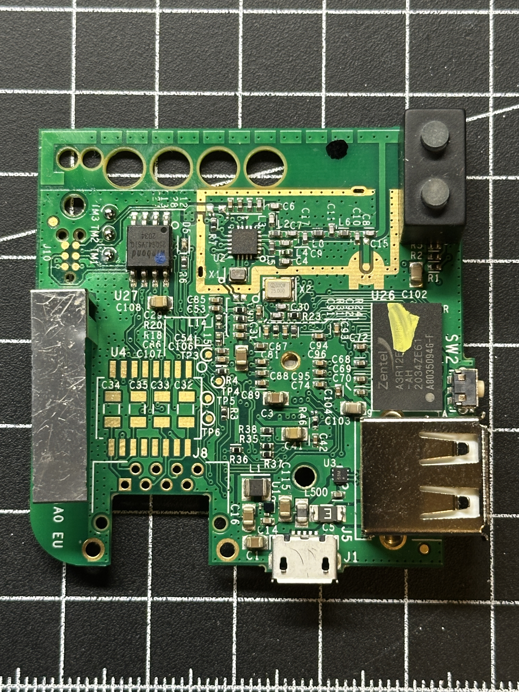
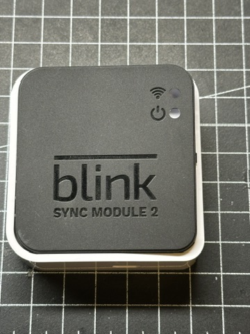

# Blink Sync Module 2 - Rev AO - Hardware Investigation

## Overview
Hardware documentation for the Blink Sync Module 2. This repository contains findings from reverse engineering and hardware exploration to gain shell access and understand the device's internals.



## Hardware Specifications

**IMPORTANT: The existing RECESSIM wiki page lists incorrect hardware for this version - Rev AO. Hardware specifications below:**

- **SOC:** Atheros AR9331 rev 1 (MIPS 24Kc @ 400MHz) - Despite boot saying 9330 its is a 9331 [AR9331 Documentation](https://github.com/Deoptim/atheros/blob/master/AR9331.pdf)
- **RAM:** 64 MB DDR2 16-bit [ISSI IS43TR16640BL Datasheet](https://www.issi.com/WW/pdf/43-46TR16640B-81280BL.pdf)
- **Flash:** 8 MB Winbond W25Q64 (SPI) [Winbond W25Q64 Datasheet](https://www.winbond.com/hq/product/code-storage-flash-memory/serial-nor-flash/)
- **WiFi:** Atheros AR9330 built-in
- **Sub-GHz Radio:** Silicon Labs Si4455 [Silicon Labs Si4455 Datasheet](https://www.silabs.com/documents/public/data-sheets/Si4455.pdf)

**The wiki previously listed NXP i.MX6 UltraLite - this is incorrect for this hardware revision.**

## UART Access

### Settings
- **Baud rate:** 115200

### Pinout
Test pads labeled TM1, TM2, TM3 on PCB:
- **TM1:** GND
- **TM2:** TX (transmit from device)
- **TM3:** RX (receive to device)

## Boot Process

### Bootloader
- **U-Boot:** 1.1.4-ffaaa3d1-clean (Build: 2023-11-16)
- **Interrupt attempts:** Tried various keys during countdown - unsuccessful
- **Debug:** Able to get verbose output by pressing 4 and enter at correct moment

### Operating System
- **OS:** OpenWrt Linux 4.14.180
- **Build date:** 2020-05-16
- **Firmware version:** 4.5.17
- **Root filesystem:** SquashFS with JFFS2 overlay

### Console Activation
During boot, the following message appears:
```
Please press Enter to activate this console.
```

**Timing:** Approximately 8 seconds into normal boot, 9+ seconds with debug level enabled

**Window duration:** Very brief (~0.4 seconds in normal boot)

**Attempts:** Automated and manual Enter key presses at various timings were unsuccessful in reliably catching the activation window

### Partition Layout
```
0x000000000000-0x000000040000 : "u-boot"       (256KB)
0x000000040000-0x000000050000 : "u-boot-env"   (64KB)
0x000000050000-0x000000200000 : "kernel"       (1728KB)
0x000000200000-0x0000007e0000 : "rootfs"       (6016KB)
0x000000640000-0x0000007e0000 : "rootfs_data"  (overlay)
0x0000007e0000-0x0000007f0000 : "NVRAM"        (64KB)
0x0000007f0000-0x000000800000 : "ART"          (64KB)
```

## 6-Pin Debug Header

### Voltage Measurements (Device Powered, Idle State)
- **Pin 1:** 3.25V
- **Pin 2:** 0V
- **Pin 3:** 0V (confirmed GND)
- **Pin 4:** 0V
- **Pin 5:** 0V
- **Pin 6:** 2.68V

### Pin Behavior Testing

**Note:** These are observations only. Actual function/purpose remains undetermined.

#### Pin 1 (3.25V)
- Appears to be VCC/power rail

#### Pin 2
- **Pulled HIGH (to 3.3V):** Device resets
- **Pulled LOW (to GND) during boot:** 
```
  ## Error: unsupported image header
  ## Error: failed to execute 'bootcmd'!
```
  Device freezes without dropping to prompt

#### Pin 3
- Confirmed GND

#### Pin 4
- **Pulled HIGH before power-on:** Device does not reach "Waiting for button press" stage
- **Pulled HIGH during "Waiting for button press":** Boot freezes at that message; device resets when pin released
- **Pulled LOW during boot:** Kernel loads but panics with:
```
  Kernel panic - not syncing: VFS: Unable to mount root fs on unknown-block
```

#### Pin 5
- **Pulled HIGH:** No obvious effect during boot; device resets when pin released
- **Pulled LOW during boot:** SPI flash not detected:
```
  m25p80 spi0.0: unrecognized JEDEC id bytes: ff, ff, ff
  VFS: Cannot open root device "(null)"
  Kernel panic - not syncing: VFS: Unable to mount root fs
```

#### Pin 6 (2.68V)
- Not tested

### Additional Pin
One isolated pin found on board:
- **Voltage:** 0V (idle)
- **Pulled HIGH during boot:** No observable change
- **Pulled LOW during boot:** No observable change

## Network Access

### WiFi Access Point
- **SSID Format:** BLINK-[ID] (e.g., BLINK-1Q50)
- **Example IP:** 172.16.97.199
- **Hostname:** blink-sync-module.lan

### Open Ports
```
PORT   STATE SERVICE
53/tcp open  domain
80/tcp open  http
```

### Access Attempts
- **SSH (port 22):** Connection refused
- **Telnet (port 23):** Connection refused

### HTTP Interface (Port 80)
- Web server accessible
- Returns system status/log information
- Example output: `INFO (pp/smapp.c:1838) [18:49:50.781]TMP 7389/7454 blocks (99%)`
- Tested common paths (/admin, /cgi-bin/, /api/) - no additional accessible endpoints found
- Brief testing found no apparent command injection vulnerabilities

## Next Steps

- [ ] Successfully interrupt U-Boot to gain bootloader access
- [ ] Successfully activate console during boot window
- [ ] Identify actual function of 6-pin header (JTAG? Boot strapping? Debug?)
- [ ] Dump and analyze SPI flash contents
- [ ] Modify firmware to enable persistent console access
- [ ] Reverse engineer Si4455 sub-GHz communication protocol

## Boot Logs

See `boot-logs/` directory for complete boot sequences:

## Related Projects

- [bling-wrt](https://github.com/lurume84/bling-wrt) - Customization for original Blink Sync Module (different hardware)
- [Blink Mini teardown](https://astrid.tech/2022/07/07/0/blink-mini-disassembly/) - Hardware analysis of Blink Mini camera
- [BlinkMonitorProtocol](https://github.com/MattTW/BlinkMonitorProtocol) - Reverse engineered cloud API documentation
- [Reversing Blink Cameras](https://www.brainonfire.net/blog/2023/10/21/reversing-blink/) - Uses Rev AO board

## Contributing

Found additional information or corrections? Please open an issue or submit a pull request!

## Disclaimer

This project is for educational and research purposes only. Modifications to your Blink Sync Module may void warranty and could potentially damage the device. The author is not responsible for any damage to hardware or loss of functionality. This work is not affiliated with or endorsed by Blink or Amazon.

## License

Documentation and findings are shared under CC BY-SA 4.0. Boot logs and hardware observations are factual data.
